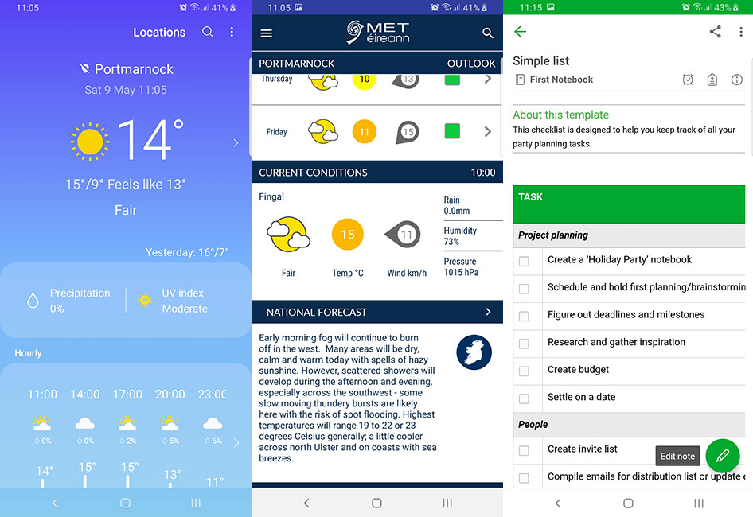

# Milestone 2 - Tourism Map - by Kevin Bourke
This project is map of Dublin for visitors to recommend places to visit and show them locations on a map. This website could be of interest to and built with support of a government agency like Fáilte Ireland, which is the National Tourism Development Authority of Ireland. Failte Ireland supports the tourism industry, and works to implement positive and practical strategies that will benefit Irish tourism. While in it's current form this site is quite limited in terms of the locations recommended, and is more a proof of concept, but you could imagine how, with time, it could grow into something like [Visit Dublin](https://www.visitdublin.com/), and becomes a real resource for tourists and local people alike.

## UX

I wanted at the very least 3 main features for this site.

There would be a separate listing of Activities (tourist - Castles, Galleries, Games like escape rooms, wall climbing), Events, Restaurants, Bars, Hotels. Different Icons would be used for different category of markers and I want users to be able to toggle map markers by category. The map will also show the Users current location (once they allow it), and I would like to be able to give directions from their location to a selected marker.

There will be a small weather widget which gives the current weather and Users can also search for other cities weather.

There will be a pull-out notepad for the user to save ideas of places to visit. They would be placed into a list and they can re-arrange them by dragging and dropping. I would like the possibility for the user to email this information to themselves as there is no database connected to store this information. 

### User Stories

This section provides insight into the UX process, focusing on who this website is for, what it is that they want to achieve and how this project is the best way to help them achieve these things.  

#### As a User

 - As a User who is either a visitor in Dublin or thinking of visiting Dublin, I want a website which shows some of the top recommended places to visit.
 - As a visitor I would also want a map to help locate places of interest and show my location and how to get to a place of interest from my location.
 - As a User who lives in Dublin, I may want to have a look in my local area for places of interest that I may not have realised were there, or did not know how to locate them.
 - As a visitor to Dublin, I may want to see what the weather is like, which would be important if I was walking or the place of interest was outdoors.
 - A a visitor to Dublin, I would like to see the weather forecast for the next couple of days, to help me determine a plan of action.
 - As a visitor to or user who lives in Dublin, it would be useful to be able to make a list of places of interest I would like to see, and arrange them in order of priority. Event thought the website will store the list it would be useful to be able to email this list to myself, so I could access this should I have no internet connection or the website is offline.
 - Find As a visitor to or user who lives in Dublin, I would also like to be able to search for other amenities in my area.

#### As a developer

I include this here as a way of explaining my mix of JavaScript and jQuery, and what I as a developer wanted to get out of this project. I only began using jQuery on this project for the animation tasks, such as the sliding panels.

I wanted to use as much native JavaScript as possible:
 - to enhance my knowledge and showcase my skills to potential employers.
 - to be able to not have to rely on JavaScript libraries like jQuery, which also provides more weight to a webpage.
 - because the continued development of JavaScript might lead to a point where the likes of jQuery may not be needed, as some of jQuery's best features are now natively available, such as better DOM selection with querySelector.
 - as I wanted a project that is not completed at this point, and could yet have many features added, especially with regard to Google Maps APIs.

### Strategy

The goals of this type of website are to:

1. Give visitors to Dublin a useful guide that does not have an overwhelming list of things to see and do, but is more tailored and gives some recommended things to see in various categories.

### Scope

This section determines what the users should be able to do on the website. Users should be able to:

1. Find the location of places of interest.
2. Find information about places of interest.
3. Get a tailored, recommended list of places of interest and not just a typical Google maps application, which while extremely useful for navigation, does not offer personal recommendations about certain places.
4. Get the current weather for Dublin. As an added extra, I can check the weather in other cities.
5. Get a weather forecast for the coming days.
6. Create a list of places of interest that they are interest in visiting, and email them to themselves for safe keeping.
7. Show their current location in relation to these recommended places.
8. Use a search field to search for other amenities nearby.

### Structure

I wanted to keep the site fairly clean and mostly about the map and recommended places of interest. Because of this I did not want the weather or Notes feature to be taking up key real estate of the page. But I still wanted easy access to these features so had them partialy hidden with the option to open them when needed. 

I wanted the Notes to be always onscreen even while scrolling so it was absolutely positioned to the right of the screen. This allows you to move from the map to recommended places without losing access to the notes you are building.

I wanted the weather to be immediately visible yet not too big and so I wanted to hide some of the information and functionality when the page loads. It would then be expandable for more functionality.

The recommended on the listings would then link to an information page for that particular location.

Each page would be designed and developed for mobile first, so the layout in that small screen is very important.

I created a [couple of sketches](assets/design/wireframes/notes-sketch-ideas.jpg) for my note taking section and got some inspiration for this from the likes of EverNote, and for my weather widget from various phone apps. I had thought about making the notepad look like a real notepad with lines and spiral binding, but decided it was a bit of a dated style and wanted a cleaner look anyway.

.

### Skeleton

This formed the basis of my wireframes, which were created in Balsamiq:
- [Home page on desktop wireframe](assets/design/wireframes/homepage-desktop.jpg)
- [Home page on desktop with widgets open wireframe](assets/design/wireframes/homepage-desktop-widgets-open.jpg)
- [Home page on mobile wireframe](assets/design/wireframes/homepage-mobile.png)
- [Home page on mobile with widgets open wireframe](assets/design/wireframes/homepage-mobile-widgets-open.png)
- [Location page on mobile wireframe](assets/design/wireframes/location-page-mobile.png)
- [Location page on desktop wireframe](assets/design/wireframes/location-page-desktop.jpg)

When I had the Weather widget and the notes list built and was testing on mobile I thought that the toggles to open the notes, the weather and the navigation menu were all too close together and crowding the top right of the screen. So I moved the weather widget left to give a bit more space between the toggles.

### Surface

The Dublin flag colours are #000080 and #88B8FD. I used these on the colour generator [Coolor](https://coolors.co/) as the basis for determining the colour scheme. You can see the [colour scheme I chose generated from Coloors here](assets/design/visiting-dublin-colour-scheme.pdf). This is a very useful tool as it also generates different shades and temperatures of your 5 selected colours. I used these colours and a variety of shades depending on the situation.

Font Families - Having read the following article I decide to keep it simple and just use 1 font family for both headings and body font. Finding fonts like Libre Baskerville that have style variants is a clever way to create nuance without overcomplicating your designs. This typeface is a classic serif that is beautifully applied as a heading and easy-to-read body copy. For reference see https://www.canva.com/learn/the-ultimate-guide-to-font-pairing/

## Technologies Used

### Languages and Frameworks
1. HTML
2. CSS
3. Javascript 
4. [Bootstrap Framework](https://getbootstrap.com/)
5. [Font Awesome](https://fontawesome.com/)
6. Google Fonts
7. Google Maps API
8. [OpenWeather Map API](https://openweathermap.org/api)
9. [JQuery](https://jquery.com) - The project uses **JQuery** to simplify DOM manipulation, and animation of certain elements.
10. [EmailJS API](https://www.emailjs.com/)

### Tools Used
1. [VS Code](https://code.visualstudio.com/) and [Brackets](http://brackets.io/) code editors.
2. [Git](https://git-scm.com/) - Installed on local devices and integrated with VS Code and Brackets, to allow version control.
3. [GitHub](https://github.com/) - Used a repository for the project files and previous versions. Also used to deploy the website.
4. [Balsamiq](https://balsamiq.com/) - Used for creating wireframes for different variations and different screen sizes.
5. I used Photoshop and Illustrator for image and svg manipulation.
6. [TinyPNG](https://tinypng.com/) - To keep transparent png sizes to a minimum I used the online png compressing service [TinyPNG](https://tinypng.com/), as well as the desktop application.
7. [Coolor](https://coolors.co/) - Used top help determine the colour scheme.

## Features
 
### Existing Features

#### Minor Features
Expand the sections below for more info on details

  
<strong>Creating navbar X to close</strong>

  
  To create the X that appears when the navbar is open, I first created an svg file from the bootstrap svg that was embedded as data:image. I edited this with Illustrator to create the X and then I had to copy the stroke styles for the path from the bootstrap svg so it was visible. 
  Then i added the class 'collapsed' to the button.navbar-toggler element in the HTML, so it has this class by default on load (usually only added upon clicking  menu toggle the first time). I overrode the default background images for the toggle icon, and changed the image when the toggler does not have the class 'collapsed' on it.

  
<strong>Skip to main content</strong>

 There is a 'Skip to main content' link just inside the body tag for accessibility for screenreaders. The main content is not usually the first thing on a web page. Keyboard and screen reader users generally must navigate a long list of navigation links, sub-lists of links, corporate icons, site searches, and other elements before ever arriving at the main content. This is then hidden from view with the bootstrap class 'sr-only', however when it receives focus from keyboard it becomes visible, by basically reversing the Bootstrap CSS properties on focus. This is based on accessibility recommendations from https://webaim.org/techniques/skipnav/. This can be checked by pressing tab when a pages loads.
 

  
<strong>Anchor scroll</strong>

One of the links in the nav is to the Recommendations section on the homepage. This links to an anchor point on the homepage. To get a nice scroll to the anchor point within then homepage, I used the css scroll-behaviour property based off [CSS Tricks](https://css-tricks.com/almanac/properties/s/scroll-behavior/). This property is not fully supported, particularly on Safari (both Mac and iPhone), but it will degrade gracefully and still jump to the anchor point on those devices.

### Features to consider implementing in the future

1. Ideally the user could click on a button from an info window and/or the location page to store the location to the list or type their own text.
2. A blog could be incorporated into the site with updates about an author or users' experiences of certain places of interest. This would add more genuineness and authority to the site.
4. Map Marker Clustering.
5. Currently I just show the Recommended places carousel on mobile and hide it on desktop, and just show the grid on larger than mobile sizes. Ideally I would not want to be repeating these elements and would like to find a way to convert the carousel to this on larger screen sizes. This is does not seem to be supported out of the box by Bootstrap, where you can go from a carousel with 4 items to 1 on a mobile screen.
6. My own photography. I would have loved to take photos from around Dublin city myself, so I could get exactly what I needed and not rely on stock images and crediting other people, but the virus pandemic did not permit me to do so.
7. Directions from your location, would be an ideal addition to this website.
9. Adding a toggle on the weather widget to change between celcuis and fahrenheit, for our American friends.
8. A page with information about public transport, bikes, and car hire. You could even tap into Dublin Bus and Irish Rail's APIs for timetables and realtime information.
9. If this was a real site (you need to registered travel agent) you could use something like https://www.viator.com/distribution-partners to list and purchase activities, like Visit Galway does on this page https://visitgalway.ie/tours-excursions/.
10. Add more markers and recommended locations. The list could be never-ending if you get into adding things like restaurants and bars.

## Testing

### Weather Input
I wanted to test my input field for the weather widget to make sure a string was entered, as a number would break my weather API call. I want to make sure to expect the unexpected input.

I tried to use Jasmine to automate some of the testing on the function writeToDocument() in the weather.js file which will check if the value is a number, blank or a string and give feedback to the user. I feel I do not really have knowledge yet to do proper Jasmine testing so limited it just to this function. For example, I am not sure that Jasmine testing scripts should be left on the production code. Also as the writeToDocument function gets the user input from the input field, I had to change my writeToDocument function to accept an argument (I called testValue), which would be what Jasmine passed in. Because of this I copied my weather.js code to the /assets/testing/scripts/weatherTest.js and the html file the test runs on is /assets/testing/spec/weather-test.html

I only then discovered that the input field will return a string regardless of what is input. But I still wanted to check for a number, so found a simple regex expression to check if the string is all numbers. (reference - https://www.w3resource.com/javascript/form/all-numbers.php)

### Testing the note sending

I was having an issue where the notes being sent by email were sometimes different than the note list on screen. I could just compare the email received with the notes on the website but it was a bit awkward and slow as it relied on receiving the email from EmailJS. This could take a few minutes for the email to come through, so I knew I could just prevent the email and output the list to be emailed back to the DOM and compare with the original list. This way I was able to quickly visually compare the note list, with the list that was about to be sent and spot the differences. I temporarily commented out the emailjs.send function and created a new div below the 'Send Email' button, and inserted the list to be emailed into this div. The fix was easy enought then, I just had to make sure to update the list from the local storage within the sendMail function. I also used this for testing removing the html delete button from the lists for sending.

### Validation

#### HTML
I validated the HTML with the [W3 Validation Service](https://validator.w3.org/). It picked up a couple of stray closing tags I missed like `</i>`, and warned I need not use the type="text" attribute for javascripts.

#### CSS

I validated the CSS with the [W3 CSS Validation Service](http://www.css-validator.org/) for CSS Level 3 and no errors were found.

#### Javascript

I validated my Javascript code while editing using ESLint extension for VS Code, and also in JSHint. Most warnings were about let and const only available in ES6. The following were also noted and fixed:

- In my **weather script** I found 2 unused variables dublinCity and writeToDocument. dublinCity was left over from when I thought it would be best to use the city ID, and writeToDocument is called in the index.html file. 

- In my **jQuery** file there were no errors, but it mentioned $ was undefined, but that comes from jQuery.

- In my **take notes** script it said there was an undefined variable emailjs but this comes from the emailjs script. There are four unused variables currentList, addToList, clearList, sendMail, but these are all called from the html files.

-In my **map script** file it said there were 5 unused variables 	initMap,	toggleType,	addPoly,	removePoly,	whereAmI. These are called from the html file.
It said the google, infoWindow and map variables are undefined but they come from Google maps. It also says shoppingAreaNorth is not defined but if I put 'let' where I define a new google.maps.Polygon then my polgon function breaks and console says it is not defined. I'm not fully sure what happening here.
Similarly in my location-map script it said about the undefined Google map variables and the thisLocation variable which is declared on the individual location html page.

### Testing on Browsers, Screen sizes and Devices
I tested the website on the following browsers and devices:
- Chrome on PC and Mac
- Firefox on PC and Mac
- Safari on Mac
- Microsoft Edge V44
- Chrome on Samsung Galaxy S8, Android V9
- Firefox on Samsung Galaxy S8
- Native Browser on Samsung Galaxy S8
- Chrome on Lenovo 10" Tablet, Android V6

They all worked fine with slight variations on the 'Where am I' functionality. The native Samsung Browser seems to need your GPS location turned on, whereas Chrome on Galaxy S8 asks to turn it on.

When I deployed the site to Github Pages and tested on an Android mobile the Get weather for another city function would not work. This worked fine on my localhost on computer, so I connected my Android phone to my desktop to do remote debugging, following [Google's instruction](https://developers.google.com/web/tools/chrome-devtools/remote-debugging). Then I could use my Dev Tools console and coud see the browser error. It was telling me that mixed content was loaded over HTTPS and that the XMLHttpRequest was blocked because it was bein requested over http. So I just had to check my writeToDocument function and change the API URL to use HTTPS. My localhost was not using https so I did not see this error until this point.

I also realised it would be easier to develop locally and view the localhost site on my Android phone. I was able to set this up through Chrome Dev tools, again following [Google's instruction](https://developers.google.com/web/tools/chrome-devtools/remote-debugging/local-server).

When Testing on Safari on Mac I discovered that the 'Where am I' button/function would not work. I was getting an error "Access to geolocation was blocked over secure connection with mixed content to https://bourkekev.github.io.". When I checked the padlock it was saying it was not secure, so there was mixed http and https content. I searched my files and found that the weather api was calling icons from http only (src="https://openweathermap.org/img/wn/${forecastIcon2}@2x.png"). I changed to https and then Safari asked for my permission to locate me and it worked.

Testing other devices - I ran the website through [Browser Stack](https://www.browserstack.com/) on a free account to test on real devices and screen sizes. This is not so easy on the free (test) plan as it only gives you 1 minute per device. I was able to live test the following devices:
 - Samsung Galaxy S20, Chrome.
 - iPhone 6S Plus, Safari, 4.7 in - 2.3 x 4.1 in, Resolution 750 x 1334px, Viewport 375 x 667 dp
 iPad 7th
 - iPad Air 2, iOS v8, Safari, Resolution 9.7 in - 5.8 x 7.8in, Viewport 768 x 1024 dp
 
They worked fine apart from iPad Air 2, which seemed to break the Bootstrap grid. Some research indicated that the CSS flex property was not supported on iOS v8. Considering iOS 8 was out in 2014, this is probably not much of an issue now. Apple would usually push updated to devices over the years. Ref - https://github.com/twbs/bootstrap/issues/24012

## Deployment

### GitHub Pages
First just a note on GitHub pages, often when I first load the site on GitHub pages it does not load the map. A reload of the page and it works fine.
This site is hosted using GitHub pages, deployed directly from the master branch of GitHub. The deployed site will update automatically upon new commits to the master branch. In order for the site to deploy correctly on GitHub pages, the landing page must be named `index.html`.
You can view the deployed site at https://bourkekev.github.io/ms2-tourism-map/

To host on GitHub pages you must follow these steps:
1. Go to the project repository
2. Go to the Settings tab
3. Scroll down to the GitHub pages section and set the source to master branch. This turns on GitHub pages for this repository
4. The page reloads, so you must scroll back down to GitHub pages and there you will get your url for viewing the site

To run locally, you can clone this repository directly into the editor of your choice by pasting `git clone https://github.com/Bourkekev/ms2-tourism-map.git` into your terminal. To cut ties with this GitHub repository, type `git remote rm origin` into the terminal.

### My own domain
I also uploaded the files for my site (except git folders or files) to a sub folder on my own domain via FTP. This can be viewed at http://kevinbourke.ie/ms2-tourism-map/.
I created a robots.txt file in my domain root and added `Disallow: /ms2-tourism-map/` to prevent search engines indexing this site.

## Issues I had to overcome

### Local Storage only storing data as strings

I struggled initially to get the list items stored as it was trying to store objects. I had to decide to either store my list as a single string containing html or as an object, which would require serialising the object to text first and de-serialising it after. The easiest way was to just store the innerHTML of the List UL as a string. This got updated and overrode the existing stored value each time a new item was added.

### Selecting and deleting the list item when X button is clicked.

It sounds like an easy thing to do, but I had trouble getting an event listener to work with all the delete buttons on the Note List. I wanted to do this using plain JavaScript and not rely on jQuery just for a button click. As there were multiple buttons, the buttons were selected with getElementsByClassName and I tried looping through the buttons to add the eventListener to each. I ran into problems where it seemed the eventListener was not added to all buttons. It seems the problem was like the issue mentioned [here](https://www.nickang.com/add-event-listener-for-loop-problem-in-javascript/). Eventually I got that working but it would not work for newly created list item buttons.
In the end I added the eventListener to the body and if a click event's target has the delete button classname then it will delete that button's parent node (the li). The idea for the solution to this came from this [Stackoverflow question](https://stackoverflow.com/questions/14258787/add-event-listener-on-elements-created-dynamically). I modified this idea to fit my own website needs. 
This would have been a lot simpiler to use jQuery's on('click') but it helped me learn about delegated event handlers and that they can process events from descendant elements that are added to the document at a later time. 

### Emailed note was sometimes different than the list

The note being emailed was sometimes different than what was received in the email. It turned out I needed to make sure to get the local storage again before emailing within the sendMail function. See more detail about this in the testing section above.

### Removing the html delete button from the emailed notes

Initially when emailing the notes, the html delete button I appended to each list item was also being sent. I did not want this. But because the local storage was saving the lists as a string of html, this was what was being retrieved and sent. I tried to find a way to not store the buttons as part of the lists html but this proved quite tricky, and having thought again it seemed it would be easier to remove the button html from the string. I knew the replace method would replace text in a string, but forgot only the first instance of the value will be replaced. The (W3Schools reference)[https://www.w3schools.com/jsref/jsref_replace.asp] explained how to perform a global search, but I was getting an error. The problem was the formatting of the Regular Expression I was trying to find, in particular the html character such as the forward slash in `</button>`. I used a (regex generator)[http://regex.larsolavtorvik.com/] to find the correct format. Turned out I was only missing the escape on the html forward slash.

### Showing and hiding the weather widget

At first I wanted to just use Javascript to add and remove a class to show and hide the weather widget by using CSS animations to animate the height. But my weather widget is dynamic in height but you must set an explicit height in order to animate with CSS. You cannot use the height of the content (or auto). I researched this to be sure and found this (CSS Tricks article)[https://css-tricks.com/using-css-transitions-auto-dimensions/] about it.
So I decided to just use the jQuery show, hide or toggle methods. This nearly caught me out though because I was initially only loading jQuery Slim at this point, which actually does not include certain effects and animations. So I had to update my jQuery to load the full version.

### Getting the Map Legend Checkboxes to work

Using Google's API documentation I was able to get the custom icons legend on the map. But I wanted to be able to click these on and off by type so they are filterable. I had a lot of trouble getting the checkboxes to switch off the correct markers. For generating the checkboxes, I was following an example I found on Stackoverflow (See link below), but it turned out this did not work correctly, and checking off the categories was not turning off the correct markers. It was hard to debug as there were no errors. I went through the code checking the values I was taking from the category array, and the locations array but could not find the issue. Finally my mentor was able to walk me through the loop and arrays and what data was going where.
Basically I was taking the 'type' from my locations array and assigning them to the checkboxes' onclick function, rather than getting the category type (or key).

## Credits and References

### Design and Research
 I took inspiration for this site from the following places:
 - [Visit Dublin](https://www.visitdublin.com/)
 - [Visit Berlin](https://www.visitberlin.de/en)
 - [Visit Galway](https://visitgalway.ie/)
 - [Evernote Mobile App](https://play.google.com/store/apps/details?id=com.evernote)
 - [Samsung Weather App](https://samsung-weather.en.uptodown.com/android)
 - [Weather Widgets](https://weatherwidget.io/)
 - [Booked.net](https://www.booked.net/widgets/weather)

### Technical
 - For general references for Javascript methods I used my Code Institue notes, [MDN web docs](https://developer.mozilla.org/en-US/) and [w3schools](https://www.w3schools.com/js/default.asp).
 - For selecting and delete note list item I referenced this [Stackoverflow question](https://stackoverflow.com/questions/14258787/add-event-listener-on-elements-created-dynamically).
 - To check if input is all numbers I used this reference - https://www.w3resource.com/javascript/form/all-numbers.php
 - To convert unix timestap I referenced this article - https://coderrocketfuel.com/article/convert-a-unix-timestamp-to-a-date-in-vanilla-javascript
 - Regex generator to remove html from a string - Removing the html delete button from the emailed notes - http://regex.larsolavtorvik.com/
 - To create checkboxes for my Map Legend I followed 2 parts of an example on [Stackoverflow[(https://stackoverflow.com/questions/26778164/simple-filter-in-legend-google-maps-api-v3). One was the for-in loop {for (var key in icons)}, and the other was the toggleType function.
 - Google Places Searchbox - mostly all from Google's Places [API documentation](https://developers.google.com/maps/documentation/javascript/examples/places-searchbox)
 - I got some information about the Open WeatherMap API from this [Coding Train video](https://www.youtube.com/watch?v=ecT42O6I_WI), but in this tutorial he is using a Javascript library called P5 and is using it to draw shapes on a canvas dependin on the weather.

### Content

 - Locational information content was obtained from Wikipedia and Google, and from the specific locations own website.
 
### Media
- The photos and vectors (except logo) used in this site were obtained from:

 - Ha'Penny Bridge - [Shutterstock](https://www.shutterstock.com/g/madrugadaverde)
 - Fictional Ireland Fáilte logo was designed on https://www.freelogodesign.org/

 - The favicons were generated at https://realfavicongenerator.net/

 For Creative Commons or other attributed images see https://bourkekev.github.io/ms2-tourism-map/image-accreditations.html

### Acknowledgements

 - Thanks to my mentor Anthony Ngene for his suggestions and his time.
 - Thanks to those on Slack for reviewing my project and making suggestions.